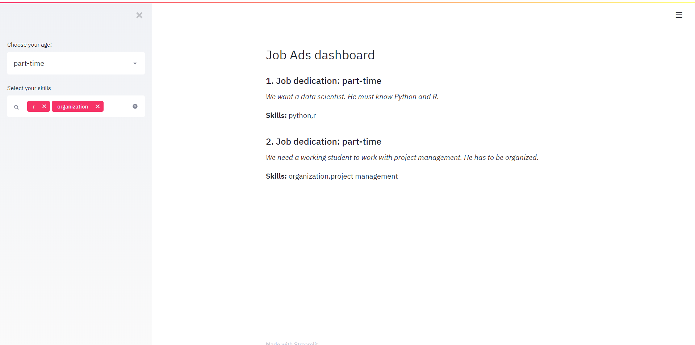

## Requirements

* Install Miniconda (Python 3.7), mark option "ADD TO PATH"

https://docs.conda.io/en/latest/miniconda.html

Make sure you can start conda. On your command line (press cmd):

```cmd
conda --version
```
You should see the current version installed.

* Create new conda environment by typing in the following in the command line:

```cmd
conda create -n job-posts python=3.7
conda activate job-posts
pip install streamlit
```

* Install required packages
```pip
cd backend
pip install -r requirements.txt
```

## Running the application

* From the command line, run

```bash
streamlit run app.py
```

* Open the browser on the displayed URL and see the dashboard

